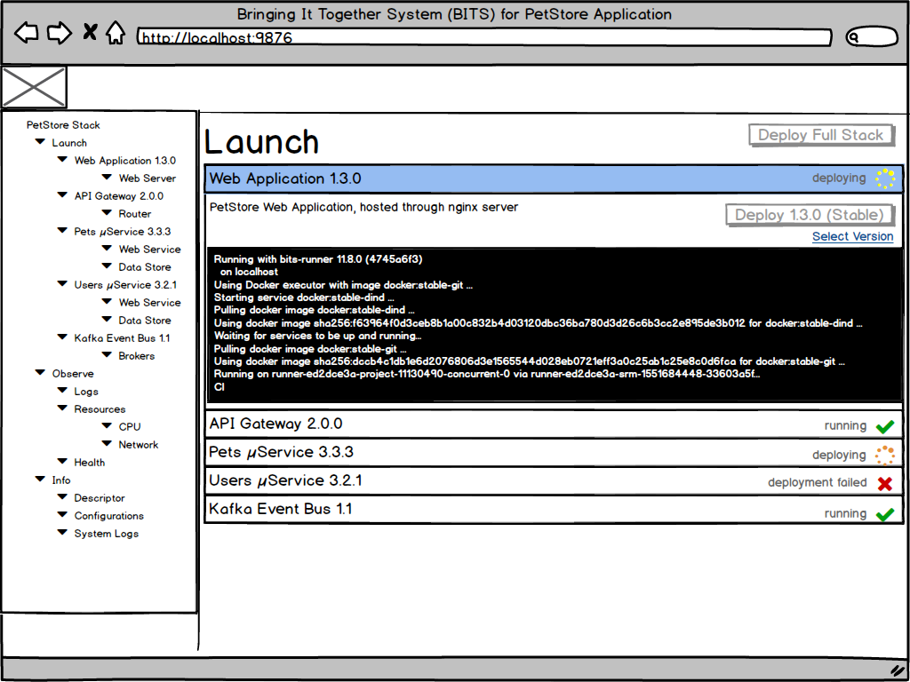

```DRAFT - WORK IN PROGRESS```

# BITS

Bringing It Together System (BITS) - Full Stack Management Solution

## Motivation

µServices have helped us scale individual resources with ease, layering on the stack as gateway, front end has yielded a lot more independence, but made a living hell out of cross team development. Understanding the entire stack from user experience (usually web based) all the way through the data store is not simple anymore. 

The goal of this initiative is to define semantics, tooling and best practices on how teams can run full stack environments at will, while still keeping up with their independence.   

### Terminology

#### Stack Definition Manifest

#### Environment Free Containers

### Components


## Getting Started

### Pre-requisites

### Installing BITS 

### Running a stack



## Features

##  Contributing

Fork this repository, send in a pull request
